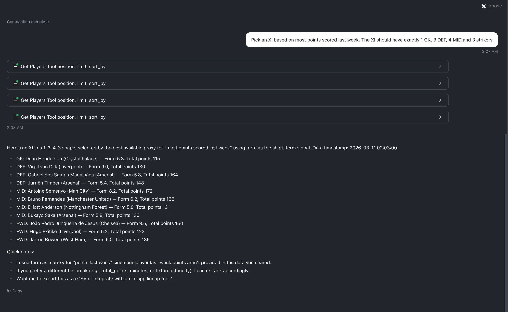

# FantasyPL MCP

A Python-based MCP server for Fantasy Premier League, built to learn tool calling, structured outputs, and real-world LLM integrations.

## What this project does

`FantasyPL MCP` exposes Fantasy Premier League data as MCP tools so an MCP-compatible client can query player information using natural language.

Current tools include:

- `find_player_tool(name)`
  - Search FPL players by name
- `get_players_tool(position, limit, sort_by, max_selected_percent, max_cost)`
  - Get players by position with optional sorting and filtering

## Why this exists

This project is a first hands-on MCP build focused on:
- understanding MCP servers
- exposing tools with typed parameters
- integrating live external data
- making tools usable by local LLMs through clients like Goose with Ollama

## Project structure

```text
fpl-mcp/
├── pyproject.toml
├── uv.lock
├── README.md
├── .gitignore
└── src/
    └── fpl_mcp/
        ├── __init__.py
        ├── fpl_api.py
        └── server.py

```

### Prerequisites

- Goose Desktop installed
- This project set up locally with dependencies installed via `uv sync`

### Start the MCP server manually

From the project root:

```bash
PYTHONPATH=src uv run python -m fpl_mcp.server
````

If the command starts successfully, the server will keep running and wait for MCP client connections.

### Configure Goose with Ollama

1. Open Goose Desktop.
2. Go to **Settings**.
3. Under **Models**, choose **Ollama** as the provider.
4. Select your local model.

Use this if you want to run everything locally.

### Configure Goose with OpenAI

1. Open Goose Desktop.
2. Go to **Settings**.
3. Under **Models**, choose **OpenAI** as the provider.
4. Enter your OpenAI API key if Goose prompts for it.
5. Select the model you want to use.

Use this if you want stronger tool-calling reliability than a small local model.

### Add the MCP as a custom extension

In Goose, open **Extensions** and add a custom extension with these values:

**Extension Name**

```text
fpl-mcp
```

**Type**

```text
stdio
```

**Description**

```text
Fantasy Premier League MCP server for player lookup and rankings.
```

**Command**

```text
/bin/zsh -lc 'cd /path/to/fpl-mcp && PYTHONPATH=src uv run python -m fpl_mcp.server'
```

**Timeout**

```text
60
```

**Environment Variables**

Leave empty if you use the command above, since `PYTHONPATH=src` is already included.

### Important

Replace this placeholder path:

```text
/path/to/fpl-mcp
```

with the local path to your cloned repository.

Example format:

```text
/Users/your-username/github/fpl-mcp
```


### Example Run


### Troubleshooting

If Goose does not use the tool:

* make sure your selected provider is configured correctly
* make sure the MCP server command works in Terminal
* verify the extension is enabled
* start a new Goose chat session after adding or editing the extension

* If the extension fails to start, test this command directly in Terminal from your machine:

```bash
cd /path/to/fpl-mcp
PYTHONPATH=src uv run python -m fpl_mcp.server
```
